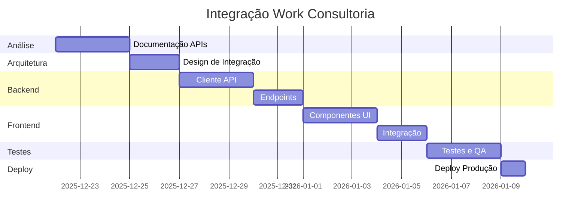

# 🚀 Plano de Integração - Work Consultoria → RSL

## 🎯 Objetivo
Integrar funcionalidades do portal Work Consultoria ao painel de buscas do RSL-Scarlet, permitindo que usuários do RSL possam acessar consultas do Work diretamente pela interface RSL.

---

## 📋 FASES DO PROJETO

### Fase 1: Análise e Documentação ✅ (Em Andamento)
**Duração Estimada:** 2-3 dias

**Tarefas:**
- [x] Criar estrutura de pastas
- [x] Criar templates de documentação
- [ ] Acessar portal Work Consultoria
- [ ] Mapear todos os módulos
- [ ] Documentar todas as APIs
- [ ] Coletar exemplos de requests/responses
- [ ] Identificar estrutura de autenticação
- [ ] Mapear tipos de dados

**Entregáveis:**
- Documentação completa de APIs
- Análise de módulos
- Exemplos de requisições

---

### Fase 2: Arquitetura da Integração
**Duração Estimada:** 2-3 dias

**Decisões Arquiteturais:**

#### Opção A: Proxy Backend (Recomendado)
```
RSL Frontend → RSL API (FastAPI) → Work Consultoria API
```

**Vantagens:**
- ✅ Contorna restrições de CORS
- ✅ Centraliza autenticação
- ✅ Permite cache de resultados
- ✅ Adiciona camada de segurança
- ✅ Facilita rate limiting

**Desvantagens:**
- ⚠️ Aumenta latência
- ⚠️ Requer deploy de código backend

#### Opção B: Cliente Direto
```
RSL Frontend → Work Consultoria API
```

**Vantagens:**
- ✅ Menor latência
- ✅ Implementação mais simples

**Desvantagens:**
- ❌ Bloqueado por CORS
- ❌ Expõe credenciais no frontend
- ❌ Sem controle de rate limiting

**Decisão:** [A definir após análise]

---

### Fase 3: Implementação Backend
**Duração Estimada:** 3-5 dias

**Componentes a Desenvolver:**

#### 1. Cliente API Work Consultoria
```python
# flowsint-api/app/integrations/workconsultoria/client.py

class WorkConsultoriaClient:
    def __init__(self, base_url: str, username: str, password: str):
        self.base_url = base_url
        self.session = None
        self.token = None
    
    async def authenticate(self):
        """Autentica e obtém token"""
        pass
    
    async def search_cpf(self, cpf: str):
        """Busca por CPF"""
        pass
    
    async def search_cnpj(self, cnpj: str):
        """Busca por CNPJ"""
        pass
    
    # ... outros métodos
```

#### 2. Modelos de Dados
```python
# flowsint-api/app/integrations/workconsultoria/models.py

from pydantic import BaseModel

class WorkPessoa(BaseModel):
    cpf: str
    nome: str
    # ... outros campos

class WorkEmpresa(BaseModel):
    cnpj: str
    razaoSocial: str
    # ... outros campos
```

#### 3. Endpoints API
```python
# flowsint-api/app/api/routes/workconsultoria.py

from fastapi import APIRouter, Depends

router = APIRouter(prefix="/api/workconsultoria", tags=["workconsultoria"])

@router.get("/cpf/{cpf}")
async def search_cpf(cpf: str):
    """Busca CPF via Work Consultoria"""
    pass

@router.get("/cnpj/{cnpj}")
async def search_cnpj(cnpj: str):
    """Busca CNPJ via Work Consultoria"""
    pass
```

#### 4. Adaptadores de Dados
```python
# flowsint-api/app/integrations/workconsultoria/adapters.py

def work_to_rsl_entity(work_data: dict) -> dict:
    """Converte dados do Work para formato RSL"""
    pass
```

---

### Fase 4: Implementação Frontend
**Duração Estimada:** 3-5 dias

**Componentes a Desenvolver:**

#### 1. Serviço API
```typescript
// flowsint-app/src/services/workconsultoria.ts

export class WorkConsultoriaService {
  async searchCPF(cpf: string) {
    return api.get(`/api/workconsultoria/cpf/${cpf}`)
  }
  
  async searchCNPJ(cnpj: string) {
    return api.get(`/api/workconsultoria/cnpj/${cnpj}`)
  }
}
```

#### 2. Componentes de UI
```typescript
// flowsint-app/src/components/work/WorkSearchPanel.tsx

export function WorkSearchPanel() {
  // Interface de busca Work Consultoria
  return (
    <div className="work-search-panel">
      <Tabs>
        <Tab label="CPF">
          <CPFSearch />
        </Tab>
        <Tab label="CNPJ">
          <CNPJSearch />
        </Tab>
        {/* ... */}
      </Tabs>
    </div>
  )
}
```

#### 3. Integração no Painel de Buscas
```typescript
// flowsint-app/src/routes/_auth.dashboard.search.tsx

// Adicionar aba "Work Consultoria" junto com as existentes
const searchCategories = [
  // ... categorias existentes
  {
    id: 'work',
    label: 'Work Consultoria',
    icon: Building,
    component: WorkSearchPanel
  }
]
```

---

### Fase 5: Testes e Validação
**Duração Estimada:** 2-3 dias

**Testes a Realizar:**

- [ ] **Testes Unitários**
  - Cliente API
  - Adaptadores
  - Modelos

- [ ] **Testes de Integração**
  - Fluxo completo de busca
  - Autenticação
  - Rate limiting

- [ ] **Testes de UI**
  - Responsividade
  - Estados de loading
  - Tratamento de erros

- [ ] **Testes de Performance**
  - Latência de requisições
  - Cache de resultados
  - Concurrent requests

---

### Fase 6: Deploy e Monitoramento
**Duração Estimada:** 1-2 dias

**Checklist de Deploy:**

- [ ] Configurar variáveis de ambiente
  ```bash
  WORK_CONSULTORIA_URL=https://app.workconsultoria.com
  WORK_CONSULTORIA_USERNAME=LukeCyberWorm
  WORK_CONSULTORIA_PASSWORD=@Lcw25257946
  ```

- [ ] Deploy backend (API)
- [ ] Build e deploy frontend
- [ ] Configurar logs
- [ ] Configurar alertas
- [ ] Documentar uso

---

## 🔒 SEGURANÇA

### Credenciais
- ✅ Armazenar credenciais em variáveis de ambiente
- ✅ NUNCA commitar credenciais no código
- ✅ Usar secrets management (Vault)
- ✅ Rotacionar senhas periodicamente

### Rate Limiting
- ✅ Implementar rate limiting no backend
- ✅ Cache de resultados para reduzir chamadas
- ✅ Retry logic com backoff exponencial

### Logs e Auditoria
- ✅ Logar todas as requisições
- ✅ Não logar dados sensíveis
- ✅ Manter histórico de consultas

---

## 📊 ESTRUTURA DE CÓDIGO

```
flowsint-api/
├── app/
│   ├── integrations/
│   │   └── workconsultoria/
│   │       ├── __init__.py
│   │       ├── client.py (cliente HTTP)
│   │       ├── models.py (modelos Pydantic)
│   │       ├── adapters.py (conversão de dados)
│   │       └── config.py (configurações)
│   └── api/
│       └── routes/
│           └── workconsultoria.py (endpoints)

flowsint-app/
├── src/
│   ├── services/
│   │   └── workconsultoria.ts (serviço API)
│   ├── components/
│   │   └── work/
│   │       ├── WorkSearchPanel.tsx
│   │       ├── CPFSearch.tsx
│   │       ├── CNPJSearch.tsx
│   │       └── ResultsTable.tsx
│   └── types/
│       └── workconsultoria.ts (tipos TypeScript)
```

---

## 📈 MÉTRICAS DE SUCESSO

### KPIs Técnicos
- Latência média < 2s
- Taxa de erro < 1%
- Uptime > 99%

### KPIs de Negócio
- Número de consultas/dia
- Usuários ativos
- Taxa de conversão

---

## 🔄 CRONOGRAMA



---

## 📞 PRÓXIMOS PASSOS IMEDIATOS

1. ✅ Estrutura de pastas criada
2. ⏳ **AGORA:** Acessar portal e documentar APIs
3. ⏳ Definir arquitetura de integração
4. ⏳ Implementar cliente backend
5. ⏳ Criar componentes frontend
6. ⏳ Testes e deploy

---

**Status Atual:** 🟡 Aguardando Análise Manual do Portal

**Responsável:** Lucas Platzeck  
**Data Início:** 22/12/2025  
**Data Prevista:** 09/01/2026  
